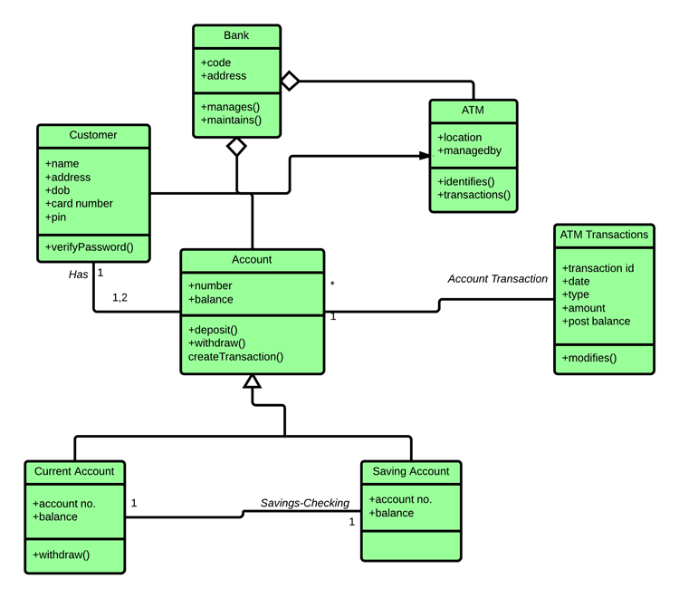

## Estructura del proyecto


El código fuente está organizado en la carpeta `src/main/java/com/example`, e incluye las siguientes clases:

- `Figura.java`: Clase abstracta que define los métodos `calculoArea()` y `calculoPerimetro()`.
- `Rectangulo.java`: Implementa los métodos para calcular el área y perímetro de un rectángulo.
- `Triangulo.java`: Implementa los métodos para calcular el área y perímetro de un triángulo.
- `Circulo.java`: Implementa los métodos para calcular el área y perímetro de un círculo.
- `Main.java`: Contiene el método `main()` que crea objetos de las figuras y muestra los cálculos.
- `FiguraTest.java`: Clase de test para verificar el comportamiento de las figuras con JUnit.

##  Dependencias

El proyecto utiliza la librería `JUnit 5` para realizar pruebas. Esta dependencia se incluye en el archivo `pom.xml`:

```xml
<dependency>
    <groupId>org.junit.jupiter</groupId>
    <artifactId>junit-jupiter</artifactId>
    <version>5.9.3</version>
    <scope>test</scope>
</dependency>
```

##  Documentación .html


 Para generar la documentación en formato .html, se han añadido los comentarios correspondientes en los diferentes objetos. 
 * Posteriormente, se ha utilizado el siguiente comando en la terminal:
 ```xml
  javadoc -d doc src/main/java/com/example/*.java
  ```
 * Este comando genera la documentación en la carpeta "doc" de todos los archivos ubicados en "src/main/java/com/example/".


## Diagrama de clases

Un diagrama de clases es una representación gráfica utilizada en el diseño de software para modelar la estructura de un sistema. Forma parte del Lenguaje Unificado de Modelado (UML, por sus siglas en inglés) y muestra las clases, sus atributos, métodos y las relaciones entre ellas.

### Componentes principales:
- **Clases**: Representan entidades del sistema, con sus atributos (propiedades) y métodos (funciones o comportamientos).
- **Relaciones**: Incluyen asociaciones, herencias, composiciones y agregaciones, que describen cómo interactúan o están conectadas las clases.
- **Visibilidad**: Indica el nivel de acceso a los atributos y métodos (público, privado, protegido).

Los diagramas de clases son útiles para planificar, documentar y comunicar la arquitectura de un sistema antes de implementarlo en código.

**Ejemplo:**


Este diagrama de clases representa un sistema de gestión de cajeros automáticos (ATM) y cuentas bancarias.


Podemos observar nuestro diagrama de clases de el ejemplo hecho:


Para ello hemos utilizado la aplicación draw.io